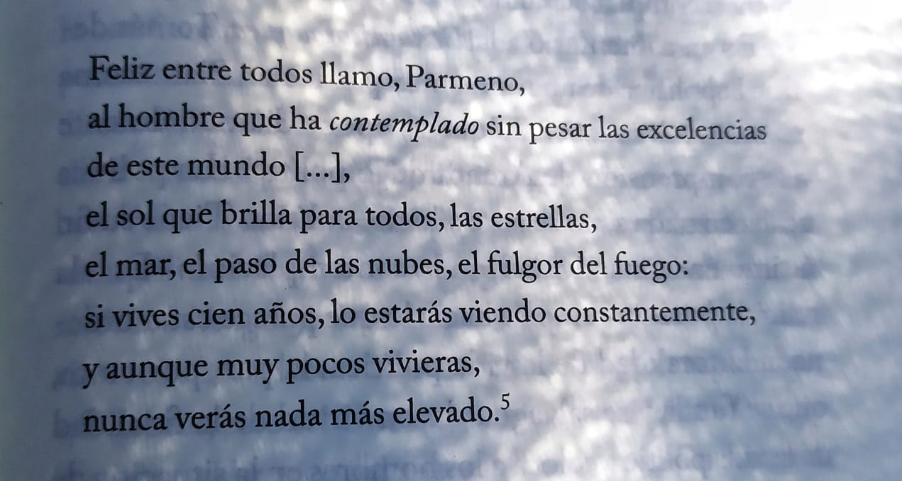

### Fragmento de Menandro
Del libro Vida Contemplativa (Byung-Chul Han)

"Happy among all, I call, Parmeno,
the man who has contemplated without sorrow the excellences of this world,
the sun that shines for all, the stars,
the sea, the passing of the clouds, the glow of the fire:
If you live for a hundred years, you will be constantly seeing this,
and even if you lived only a few,
you will never find anything higher."

---
